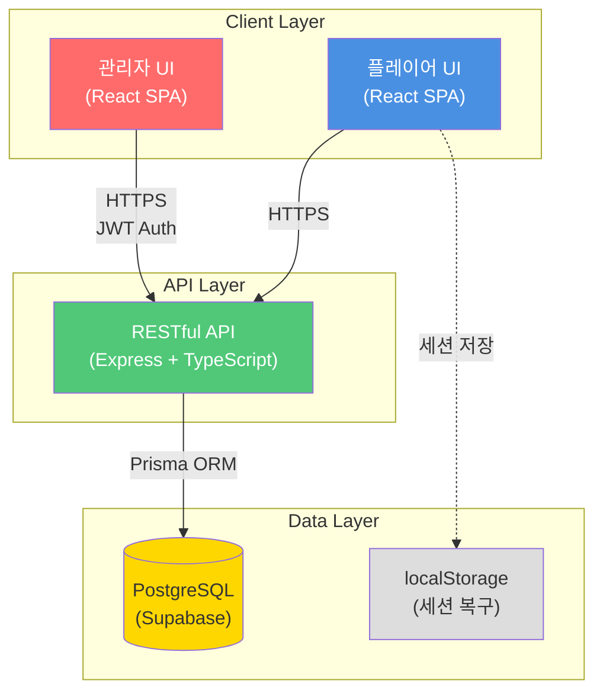
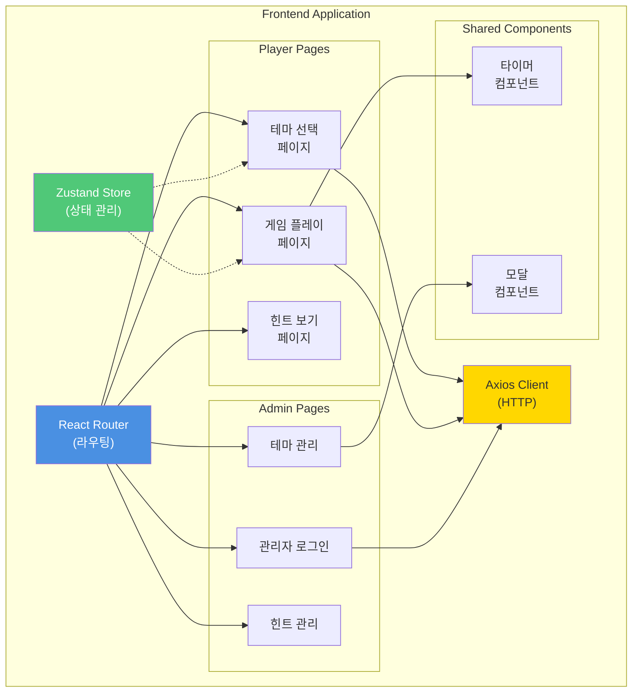
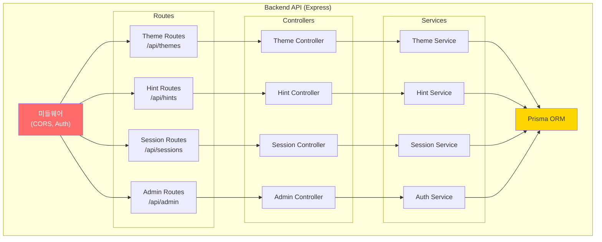
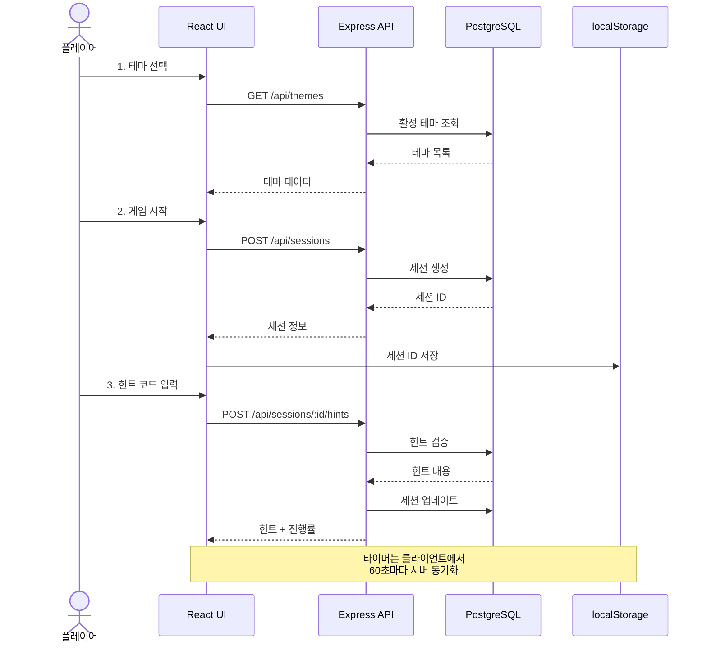
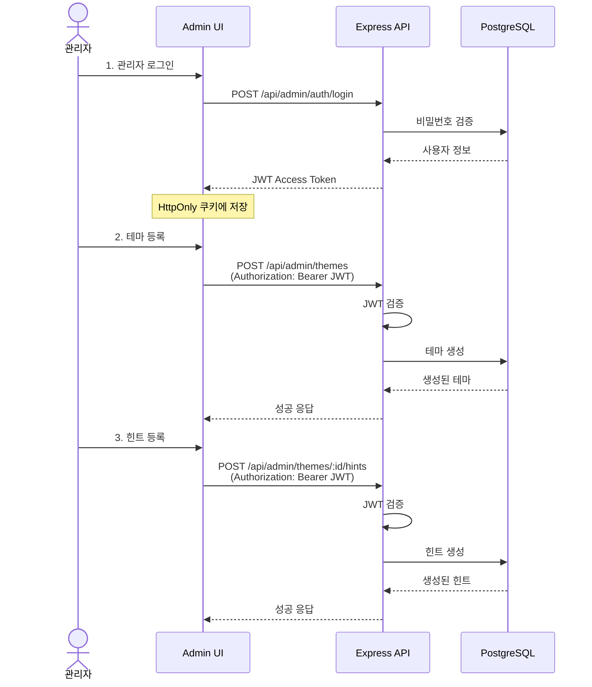
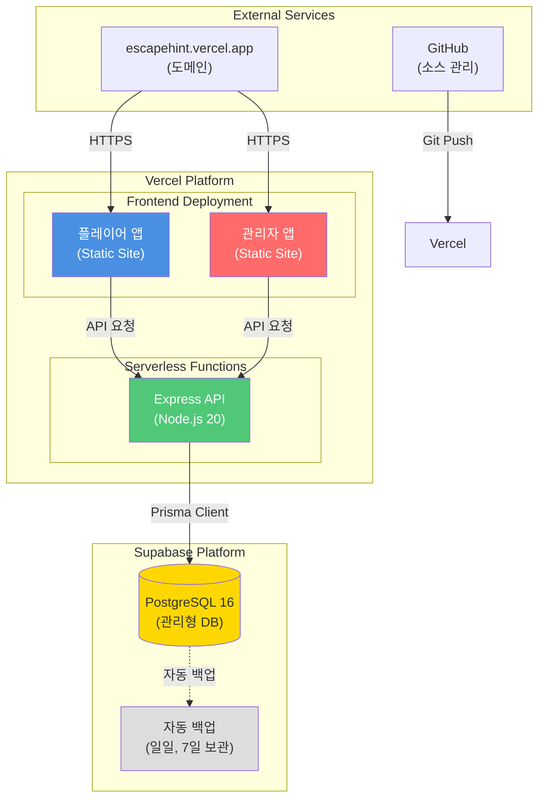
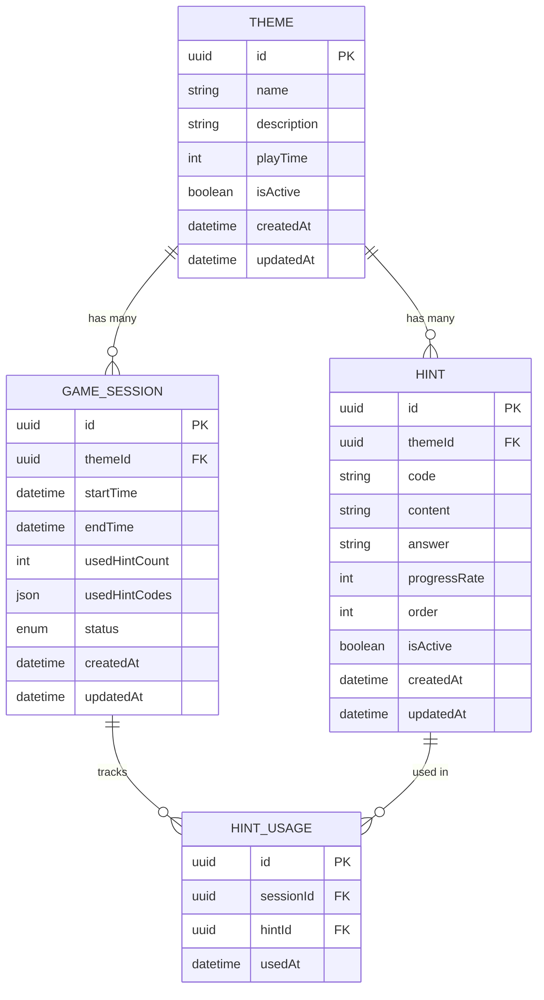
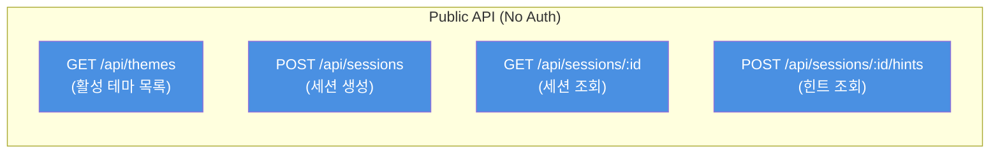
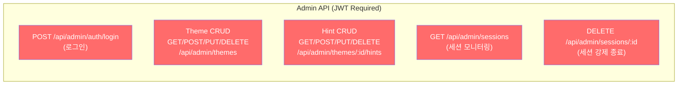

# EscapeHint - 기술 아키텍처 다이어그램

## 문서 정보

| 항목            | 내용                                      |
| --------------- | ----------------------------------------- |
| **문서 버전**   | 1.0                                       |
| **작성일**      | 2025-11-26                                |
| **작성자**      | Architecture Reviewer                     |
| **승인자**      | 윤인수                                    |
| **최종 수정일** | 2025-11-26                                |
| **문서 상태**   | 최종 승인                                 |
| **관련 문서**   | [도메인 정의서](./1-domain-definition.md), [PRD](./3-prd.md) |

---

## 개요 (Overview)

본 문서는 EscapeHint 시스템의 기술 아키텍처를 시각적으로 표현합니다. 모든 다이어그램은 **최대한 단순하게** 핵심 컴포넌트와 데이터 흐름만 표현하며, GitHub에서 렌더링 가능한 Mermaid 형식으로 작성되었습니다.

### 다이어그램 목록
1. **시스템 아키텍처** - 전체 시스템 구조 개요
2. **컴포넌트 다이어그램** - 프론트엔드/백엔드 주요 컴포넌트
3. **데이터 플로우** - 플레이어와 관리자 데이터 흐름
4. **배포 구조** - 인프라 및 배포 환경
5. **ER 다이어그램** - 데이터베이스 엔티티 관계
6. **API 엔드포인트 구조** - RESTful API 구조

---

## 1. 시스템 아키텍처 (System Architecture)

### 1.1 전체 시스템 개요



### 설명

- **Client Layer**: React 18 기반 SPA로 플레이어와 관리자 UI 분리
- **API Layer**: Express.js로 구축된 RESTful API, JWT 인증 처리
- **Data Layer**: Supabase 호스팅 PostgreSQL, 클라이언트 측 localStorage 활용

**핵심 특징:**
- 모든 통신은 HTTPS 암호화
- 관리자는 JWT 토큰 기반 인증
- 플레이어는 세션 복구를 위해 localStorage 사용

---

## 2. 컴포넌트 구조 (Component Diagram)

### 2.1 프론트엔드 컴포넌트



### 설명

**페이지 구성:**
- 플레이어: 테마 선택 → 게임 플레이 → 힌트 보기 (3단계)
- 관리자: 로그인 → 테마/힌트 관리 (2단계)

**공유 컴포넌트:**
- 타이머: 실시간 카운트다운, 서버 동기화
- 모달: 확인 다이얼로그, 정답보기 등

**상태 관리:**
- Zustand로 세션 정보, 힌트 사용 이력, 타이머 상태 관리

---

### 2.2 백엔드 컴포넌트



### 설명

**계층 구조 (3-tier):**
1. **Routes**: HTTP 요청 라우팅 및 검증
2. **Controllers**: 비즈니스 로직 호출 및 응답 처리
3. **Services**: 핵심 비즈니스 로직 및 데이터 접근

**주요 모듈:**
- Theme: 테마 CRUD 관리
- Hint: 힌트 CRUD 및 검증
- Session: 게임 세션 생성/조회/업데이트
- Auth: 관리자 JWT 인증/인가

---

## 3. 데이터 플로우 (Data Flow)

### 3.1 플레이어 데이터 플로우



### 설명

**주요 단계:**
1. **테마 선택**: 활성 테마 목록 조회
2. **게임 시작**: 세션 생성 및 localStorage에 저장
3. **힌트 조회**: 코드 검증 후 힌트 내용 반환, 세션 업데이트

**성능 최적화:**
- 타이머는 클라이언트에서 작동, 60초마다만 서버 동기화
- 세션 ID는 localStorage에 저장하여 브라우저 새로고침 시에도 복구

---

### 3.2 관리자 데이터 플로우



### 설명

**인증 흐름:**
1. **로그인**: 비밀번호 검증 후 JWT 발급
2. **인가**: 모든 관리자 API는 JWT 토큰 필수
3. **보안**: JWT는 HttpOnly 쿠키에 저장하여 XSS 방지

**주요 작업:**
- 테마/힌트 CRUD 작업은 모두 JWT 인증 필요
- 관리자는 진행 중인 세션 조회 및 강제 종료 가능

---

## 4. 배포 구조 (Deployment Diagram)

### 4.1 인프라 아키텍처



### 설명

**Vercel 배포:**
- 프론트엔드: 정적 사이트로 빌드 후 CDN 배포
- 백엔드: 서버리스 함수로 Express API 배포
- 자동 배포: Git push 시 자동 빌드/배포

**Supabase 호스팅:**
- PostgreSQL 16 관리형 데이터베이스
- 일일 자동 백업 (7일 보관, 무료 티어)
- Prisma ORM으로 타입 안전 쿼리

**도메인 및 보안:**
- Vercel 자동 SSL/TLS 인증서
- HTTPS 강제 적용
- CORS 설정으로 허용된 도메인만 API 접근

---

### 4.2 배포 플로우


### 설명

**CI/CD 파이프라인:**
1. 개발자가 로컬에서 코드 작성 후 Git Push
2. GitHub main 브랜치에 푸시 시 Webhook 트리거
3. Vercel이 자동으로 빌드 및 배포
4. Production 환경에 즉시 반영 (< 2분)

**배포 환경:**
- **Development**: 로컬 환경 (npm run dev)
- **Production**: Vercel 배포 (main 브랜치)

---

## 5. 데이터 모델 (ER Diagram)

### 5.1 엔티티 관계도



### 설명

**주요 엔티티:**

1. **THEME (테마)**
   - 방탈출 게임 테마 정보
   - 제한 시간(playTime), 활성화 상태(isActive) 관리

2. **HINT (힌트)**
   - 특정 테마에 속한 힌트
   - 코드(code), 내용(content), 정답(answer), 진행률(progressRate)
   - 테마 내에서 코드 중복 불가 (UNIQUE 제약)

3. **GAME_SESSION (게임 세션)**
   - 플레이어의 게임 진행 상태
   - 사용 힌트 코드 목록(usedHintCodes)은 JSON 배열로 저장
   - 상태: in_progress, completed, aborted

4. **HINT_USAGE (힌트 사용 기록)**
   - 세션별 힌트 사용 이력 추적
   - 통계 분석용 (2차 버전)

**관계:**
- Theme (1) → (N) Hint
- Theme (1) → (N) GameSession
- GameSession (N) ↔ (N) Hint (through HINT_USAGE)

---

### 5.2 주요 제약 조건

```sql
-- 테마 내 힌트 코드 고유성
UNIQUE INDEX hint_theme_code_unique ON HINT(themeId, code);

-- 진행률 범위 제약
CHECK (progressRate >= 0 AND progressRate <= 100);

-- 제한 시간 범위 제약
CHECK (playTime >= 10 AND playTime <= 180);

-- 세션 상태 제약
ENUM status ('in_progress', 'completed', 'aborted');
```

---

## 6. API 엔드포인트 구조

### 6.1 플레이어 API



### 플레이어 API 상세

| 메서드 | 엔드포인트 | 설명 | 요청 | 응답 |
|--------|-----------|------|------|------|
| GET | `/api/themes` | 활성 테마 목록 | - | `Theme[]` |
| POST | `/api/sessions` | 게임 세션 생성 | `{ themeId }` | `{ sessionId, startTime }` |
| GET | `/api/sessions/:id` | 세션 정보 조회 | - | `GameSession` |
| POST | `/api/sessions/:id/hints` | 힌트 조회 | `{ code }` | `{ hint, progressRate }` |

---

### 6.2 관리자 API



### 관리자 API 상세

| 메서드 | 엔드포인트 | 설명 | 인증 | 요청 | 응답 |
|--------|-----------|------|------|------|------|
| POST | `/api/admin/auth/login` | 관리자 로그인 | - | `{ password }` | `{ token }` |
| GET | `/api/admin/themes` | 테마 목록 조회 | JWT | - | `Theme[]` |
| POST | `/api/admin/themes` | 테마 생성 | JWT | `{ name, playTime }` | `Theme` |
| PUT | `/api/admin/themes/:id` | 테마 수정 | JWT | `{ name, playTime }` | `Theme` |
| DELETE | `/api/admin/themes/:id` | 테마 삭제 | JWT | - | `{ success }` |
| GET | `/api/admin/themes/:id/hints` | 힌트 목록 조회 | JWT | - | `Hint[]` |
| POST | `/api/admin/themes/:id/hints` | 힌트 생성 | JWT | `{ code, content }` | `Hint` |
| PUT | `/api/admin/hints/:id` | 힌트 수정 | JWT | `{ content, answer }` | `Hint` |
| DELETE | `/api/admin/hints/:id` | 힌트 삭제 | JWT | - | `{ success }` |
| GET | `/api/admin/sessions` | 세션 모니터링 | JWT | - | `GameSession[]` |
| DELETE | `/api/admin/sessions/:id` | 세션 강제 종료 | JWT | - | `{ success }` |

---

## 7. 기술 스택 요약

### 7.1 프론트엔드

| 분류 | 기술 | 버전 | 용도 |
|------|------|------|------|
| 프레임워크 | React | 18.x | UI 구축 |
| 언어 | TypeScript | 5.x | 타입 안전성 |
| 빌드 도구 | Vite | 5.x | 빠른 개발 서버 |
| 상태 관리 | Zustand | 5.x | 간단한 상태 관리 |
| 스타일링 | Tailwind CSS | 3.x | 유틸리티 CSS |
| 라우팅 | React Router | 6.x | 페이지 라우팅 |
| HTTP 클라이언트 | Axios | 1.x | API 통신 |
| 폼 관리 | React Hook Form | 7.x | 폼 검증 |

---

### 7.2 백엔드

| 분류 | 기술 | 버전 | 용도 |
|------|------|------|------|
| 런타임 | Node.js | 20.x LTS | JavaScript 실행 |
| 언어 | TypeScript | 5.x | 타입 안전성 |
| 프레임워크 | Express.js | 4.x | RESTful API |
| ORM | Prisma | 5.x | 데이터베이스 쿼리 |
| 인증 | JWT | - | 관리자 인증 |
| 검증 | Zod | 3.x | 스키마 검증 |
| 로깅 | Winston | 3.x | 구조화된 로깅 |
| 보안 | bcrypt, helmet | - | 비밀번호 해싱, 보안 헤더 |

---

### 7.3 인프라

| 분류 | 기술 | 용도 |
|------|------|------|
| 호스팅 | Vercel | 프론트엔드 + 백엔드 배포 |
| 데이터베이스 | Supabase (PostgreSQL 16) | 관리형 DB 호스팅 |
| 버전 관리 | Git + GitHub | 소스 코드 관리 |
| CI/CD | Vercel 자동 배포 | Git push 시 자동 배포 |
| 도메인 | escapehint.vercel.app | 기본 도메인 |
| SSL/TLS | Vercel 자동 인증서 | HTTPS 보안 |

---

### 7.4 개발 도구

| 분류 | 기술 | 용도 |
|------|------|------|
| 패키지 매니저 | pnpm | 의존성 관리 |
| 코드 포맷터 | Prettier | 코드 스타일 통일 |
| 린터 | ESLint | 코드 품질 검사 |
| 테스트 | Vitest (선택) | 유닛 테스트 |
| E2E 테스트 | Playwright (선택) | 통합 테스트 |

---

## 8. 아키텍처 설계 원칙

### 8.1 단순성 (Simplicity)

**원칙**: 최소한의 기술 스택으로 빠른 개발 및 유지보수

- 모노레포 대신 프론트/백엔드 단일 프로젝트
- 복잡한 마이크로서비스 대신 모놀리식 API
- Redis 캐시 없이 단순한 DB 쿼리 최적화

---

### 8.2 확장성 (Scalability)

**원칙**: 향후 확장 가능한 구조

- 계층 분리 (Routes → Controllers → Services)
- Prisma ORM으로 DB 마이그레이션 관리
- Vercel 서버리스 함수 자동 스케일링

---

### 8.3 보안 (Security)

**원칙**: 최소 권한 및 데이터 보호

- 관리자 API는 JWT 인증 필수
- 비밀번호는 bcrypt 해싱
- HttpOnly 쿠키로 XSS 방지
- HTTPS 강제 적용

---

### 8.4 성능 (Performance)

**원칙**: 빠른 응답 및 낮은 지연 시간

- API 응답 시간 P95 < 200ms
- 타이머는 클라이언트 작동 (서버 부하 감소)
- localStorage 활용으로 네트워크 요청 최소화
- Vercel CDN으로 정적 리소스 빠른 전송

---

## 9. 아키텍처 의사결정 기록 (ADR)

### ADR-01: Vercel 풀스택 배포

**결정**: Vercel에서 프론트엔드와 백엔드를 함께 배포

**이유**:
- 무료 티어로 충분한 트래픽 처리 (동시 100명)
- Git 연동 자동 배포로 CI/CD 간편
- 서버리스 함수로 백엔드 배포 가능
- SSL/TLS 인증서 자동 관리

**대안**: Netlify (프론트) + Heroku (백엔드) → 비용 및 복잡도 증가

---

### ADR-02: Zustand 상태 관리

**결정**: Redux 대신 Zustand 사용

**이유**:
- 보일러플레이트 최소화 (Redux는 설정 복잡)
- 세션 정보, 타이머 상태 등 단순한 상태에 적합
- 학습 곡선 낮음 (1인 개발자)

**대안**: Redux, Recoil → 오버엔지니어링

---

### ADR-03: Prisma ORM

**결정**: 순수 SQL 대신 Prisma 사용

**이유**:
- TypeScript 완벽 통합 (타입 안전성)
- 자동 마이그레이션 생성
- 직관적인 쿼리 API

**대안**: TypeORM, Sequelize → Prisma가 더 현대적

---

### ADR-04: JWT 인증 (Stateless)

**결정**: 세션 기반 대신 JWT 토큰 인증

**이유**:
- Stateless 방식으로 서버리스 환경에 적합
- 확장성 좋음 (세션 스토리지 불필요)
- Refresh Token으로 자동 갱신 가능

**대안**: 세션 기반 (Redis) → 추가 인프라 필요

---

## 10. 향후 개선 방향 (Roadmap)

### 2차 버전 (2026 Q1)

- **Redis 캐싱**: API 응답 캐싱으로 성능 향상
- **이미지 힌트 지원**: Cloudinary 연동
- **세션 모니터링 고도화**: 실시간 WebSocket 연결
- **통계 대시보드**: 테마별 힌트 사용 분석

---

### 3차 버전 (2026 Q2)

- **PWA 지원**: 오프라인 사용 가능
- **다국어 지원**: i18n 라이브러리 도입
- **2FA 인증**: 관리자 보안 강화
- **동적 힌트 코드**: 세션별 고유 코드 생성

---

## 11. 참고 자료

- [도메인 정의서](./1-domain-definition.md) - 비즈니스 규칙 및 엔티티
- [PRD](./3-prd.md) - 기술 스택 및 요구사항
- [사용자 시나리오](./4-user-scenario.md) - 데이터 흐름 참고
- [Mermaid 문서](https://mermaid.js.org/) - 다이어그램 문법

---

## 12. 문서 변경 이력

| 버전 | 날짜       | 작성자                | 변경 내용                                  | 승인자 |
| ---- | ---------- | --------------------- | ------------------------------------------ | ------ |
| 1.0  | 2025-11-26 | Architecture Reviewer | 초안 작성 (5개 다이어그램 + API 구조)      | 윤인수 |

---

## 문서 승인

본 문서는 EscapeHint 프로젝트의 공식 기술 아키텍처 문서로, 개발팀이 시스템 구조를 이해하고 구현할 수 있도록 작성되었습니다.

**승인자**: 윤인수
**승인일**: 2025-11-26
**문서 상태**: 최종 승인 완료

---

**다음 단계**:
1. **DB 스키마 구현**: Prisma 스키마 파일 작성
2. **API 명세서**: 상세 RESTful API 엔드포인트 정의
3. **개발 착수**: Phase 1 개발 시작 (2025-11-26)

---

**문서 끝**
