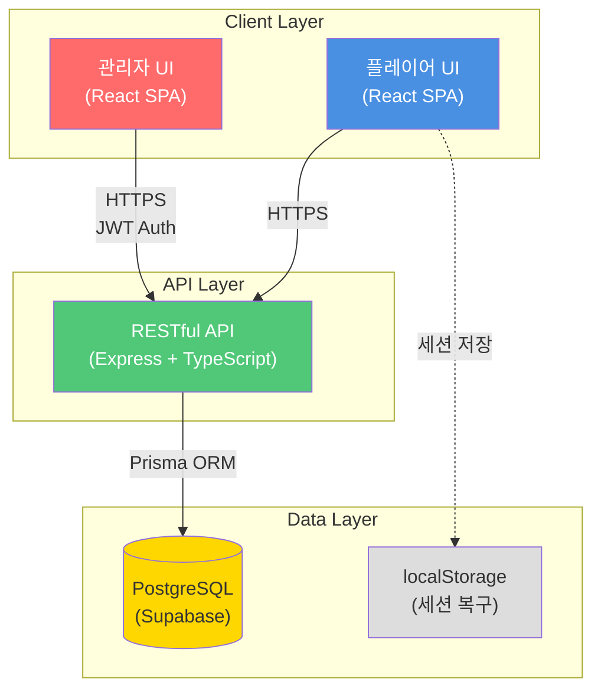
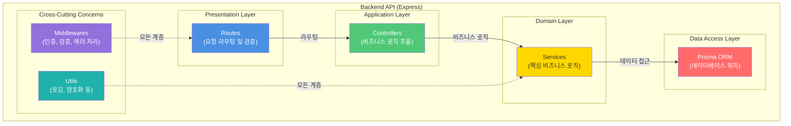
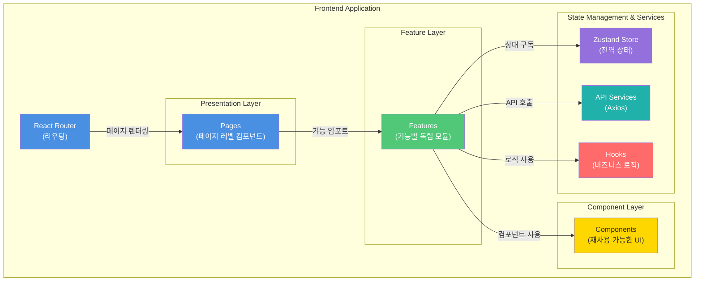
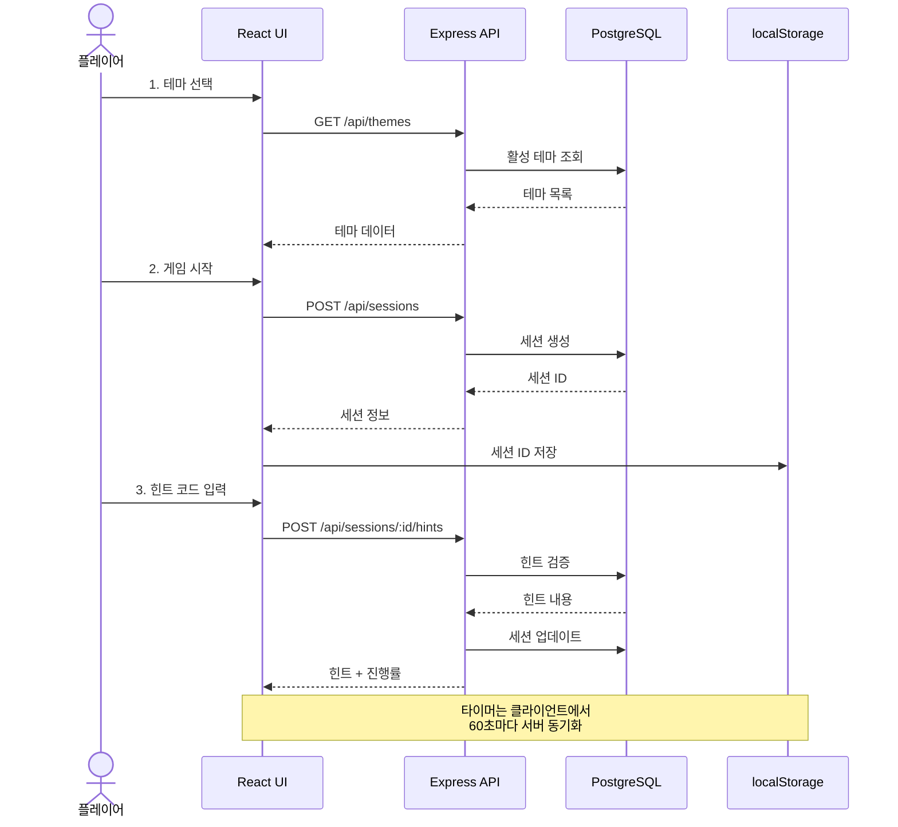
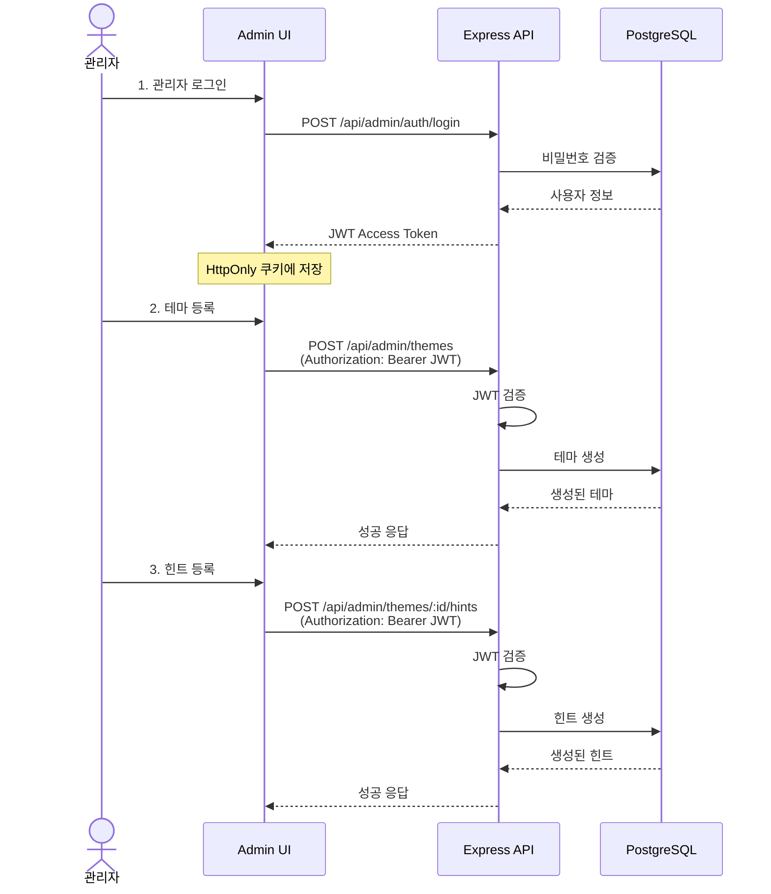
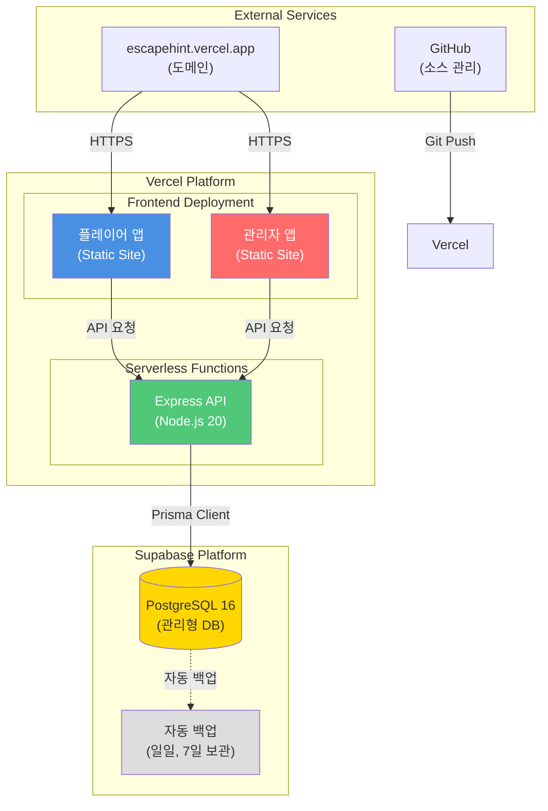
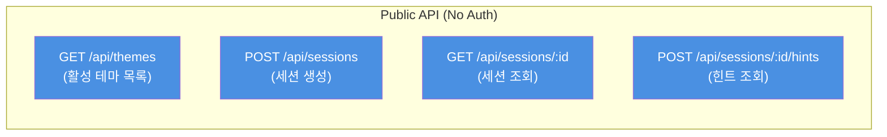
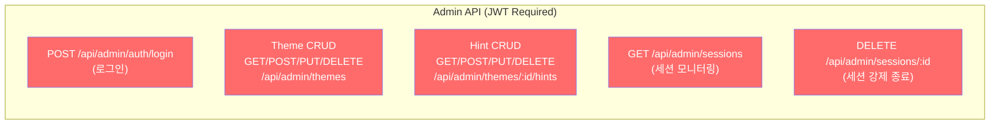

# EscapeHint - 기술 아키텍처 다이어그램

## 문서 정보

| 항목            | 내용                                                                                                         |
| --------------- | ------------------------------------------------------------------------------------------------------------ |
| **문서 버전**   | 1.1                                                                                                          |
| **작성일**      | 2025-11-26                                                                                                   |
| **작성자**      | Architecture Reviewer                                                                                        |
| **승인자**      | 윤인수                                                                                                       |
| **최종 수정일** | 2025-11-26                                                                                                   |
| **문서 상태**   | 최종 승인                                                                                                    |
| **관련 문서**   | [도메인 정의서](./1-domain-definition.md), [PRD](./3-prd.md), [프로젝트 구조 원칙](./5-project-structure.md) |

---

## 개요 (Overview)

본 문서는 EscapeHint 시스템의 기술 아키텍처를 시각적으로 표현합니다. 모든 다이어그램은 **최대한 단순하게** 핵심 컴포넌트와 데이터 흐름만 표현하며, GitHub에서 렌더링 가능한 Mermaid 형식으로 작성되었습니다.

### 아키텍처 철학

EscapeHint는 다음 세 가지 핵심 가치를 중심으로 설계됩니다:

1. **단순성 우선 (Simplicity First)**: MVP는 최소한의 기술 스택으로 빠르게 구현
2. **점진적 확장 (Progressive Enhancement)**: 초기에는 텍스트 힌트만 지원, 차후 이미지/비디오 추가
3. **사용자 중심 설계 (User-Centric Design)**: 플레이어 몰입도 유지, 관리자는 5분 내 작업 완료

### 다이어그램 목록

1. **시스템 아키텍처** - 전체 시스템 구조 개요
2. **컴포넌트 다이어그램** - 프론트엔드/백엔드 주요 컴포넌트
3. **데이터 플로우** - 플레이어와 관리자 데이터 흐름
4. **배포 구조** - 인프라 및 배포 환경
5. **API 엔드포인트 구조** - RESTful API 구조

---

## 1. 시스템 아키텍처 (System Architecture)

### 1.1 전체 시스템 개요

### 설명

- **Client Layer**: React 18 기반 SPA로 플레이어와 관리자 UI 분리
- **API Layer**: Express.js로 구축된 RESTful API, JWT 인증 처리
- **Data Layer**: Supabase 호스팅 PostgreSQL, 클라이언트 측 localStorage 활용

**핵심 특징:**

- 모든 통신은 HTTPS 암호화
- 관리자는 JWT 토큰 기반 인증
- 플레이어는 세션 복구를 위해 localStorage 사용

---

## 2. 컴포넌트 구조 (Component Diagram)

### 2.1 백엔드 아키텍처 (3-Tier Layered Architecture)

### 설명

**3-Tier Layered Architecture 원칙:**

1. **Routes**: HTTP 요청 라우팅 및 입력 검증
2. **Controllers**: 비즈니스 로직 호출 및 응답 처리
3. **Services**: 핵심 비즈니스 로직 및 데이터 접근 조율
4. **Prisma ORM**: 타입 안전 데이터베이스 쿼리

**주요 모듈:**

- Theme: 테마 CRUD 관리
- Hint: 힌트 CRUD 및 검증
- Session: 게임 세션 생성/조회/업데이트
- Auth: 관리자 JWT 인증/인가

**의존성 방향:** 상위 → 하위만 의존 (역의존 금지)

---

### 2.2 프론트엔드 아키텍처 (Component-Based)

### 설명

**Component-Based Architecture 원칙:**

1. **Pages**: 라우터와 1:1 매핑되는 페이지 컴포넌트
2. **Features**: 기능별 독립 모듈 (components + hooks + types)
3. **Components**: 순수 UI 컴포넌트 (props만 사용)
4. **Hooks**: 비즈니스 로직 및 상태 관리 캡슐화
5. **Stores**: Zustand로 전역 상태 관리
6. **Services**: Axios 기반 API 통신

**Container/Presentational Pattern 적용:**

- Container 컴포넌트: 상태 관리, API 호출, 비즈니스 로직
- Presentational 컴포넌트: 순수한 UI 렌더링

---

## 3. 데이터 플로우 (Data Flow)

### 3.1 플레이어 데이터 플로우

### 설명

**주요 단계:**

1. **테마 선택**: 활성 테마 목록 조회
2. **게임 시작**: 세션 생성 및 localStorage에 저장
3. **힌트 조회**: 코드 검증 후 힌트 내용 반환, 세션 업데이트

**성능 최적화:**

- 타이머는 클라이언트에서 작동, 60초마다만 서버 동기화
- 세션 ID는 localStorage에 저장하여 브라우저 새로고침 시에도 복구
- 힌트 데이터는 세션 시작 시 전체 다운로드 (네트워크 단절 대비)

---

### 3.2 관리자 데이터 플로우

### 설명

**인증 흐름:**

1. **로그인**: 비밀번호 검증 후 JWT 발급
2. **인가**: 모든 관리자 API는 JWT 토큰 필수
3. **보안**: JWT는 HttpOnly 쿠키에 저장하여 XSS 방지

**주요 작업:**

- 테마/힌트 CRUD 작업은 모두 JWT 인증 필요
- 관리자는 진행 중인 세션 조회 및 강제 종료 가능
- 토큰 만료 시 Refresh Token으로 자동 갱신

---

## 4. 배포 구조 (Deployment Diagram)

### 4.1 인프라 아키텍처

### 설명

**Vercel 배포:**

- 프론트엔드: 정적 사이트로 빌드 후 CDN 배포
- 백엔드: 서버리스 함수로 Express API 배포
- 자동 배포: Git push 시 자동 빌드/배포

**Supabase 호스팅:**

- PostgreSQL 16 관리형 데이터베이스
- 일일 자동 백업 (7일 보관, 무료 티어)
- Prisma ORM으로 타입 안전 쿼리

**도메인 및 보안:**

- Vercel 자동 SSL/TLS 인증서
- HTTPS 강제 적용
- CORS 설정으로 허용된 도메인만 API 접근

---

### 4.2 배포 플로우

### 설명

**CI/CD 파이프라인:**

1. 개발자가 로컬에서 코드 작성 후 Git Push
2. GitHub main 브랜치에 푸시 시 Webhook 트리거
3. Vercel이 자동으로 빌드 및 배포
4. Production 환경에 즉시 반영 (< 2분)

**배포 환경:**

- **Development**: 로컬 환경 (npm run dev)
- **Production**: Vercel 배포 (main 브랜치)
- **Preview**: Feature 브랜치별 자동 배포

---

## 5. API 엔드포인트 구조

### 6.1 플레이어 API

### 플레이어 API 상세

| 메서드 | 엔드포인트                | 설명           | 요청          | 응답                       |
| ------ | ------------------------- | -------------- | ------------- | -------------------------- |
| GET    | `/api/themes`             | 활성 테마 목록 | -             | `Theme[]`                  |
| POST   | `/api/sessions`           | 게임 세션 생성 | `{ themeId }` | `{ sessionId, startTime }` |
| GET    | `/api/sessions/:id`       | 세션 정보 조회 | -             | `GameSession`              |
| POST   | `/api/sessions/:id/hints` | 힌트 조회      | `{ code }`    | `{ hint, progressRate }`   |

---

### 5.2 관리자 API

### 관리자 API 상세

| 메서드 | 엔드포인트                    | 설명           | 인증 | 요청                  | 응답            |
| ------ | ----------------------------- | -------------- | ---- | --------------------- | --------------- |
| POST   | `/api/admin/auth/login`       | 관리자 로그인  | -    | `{ password }`        | `{ token }`     |
| GET    | `/api/admin/themes`           | 테마 목록 조회 | JWT  | -                     | `Theme[]`       |
| POST   | `/api/admin/themes`           | 테마 생성      | JWT  | `{ name, playTime }`  | `Theme`         |
| PUT    | `/api/admin/themes/:id`       | 테마 수정      | JWT  | `{ name, playTime }`  | `Theme`         |
| DELETE | `/api/admin/themes/:id`       | 테마 삭제      | JWT  | -                     | `{ success }`   |
| GET    | `/api/admin/themes/:id/hints` | 힌트 목록 조회 | JWT  | -                     | `Hint[]`        |
| POST   | `/api/admin/themes/:id/hints` | 힌트 생성      | JWT  | `{ code, content }`   | `Hint`          |
| PUT    | `/api/admin/hints/:id`        | 힌트 수정      | JWT  | `{ content, answer }` | `Hint`          |
| DELETE | `/api/admin/hints/:id`        | 힌트 삭제      | JWT  | -                     | `{ success }`   |
| GET    | `/api/admin/sessions`         | 세션 모니터링  | JWT  | -                     | `GameSession[]` |
| DELETE | `/api/admin/sessions/:id`     | 세션 강제 종료 | JWT  | -                     | `{ success }`   |

---

## 6. 기술 스택 요약

### 6.1 프론트엔드

| 분류            | 기술            | 버전 | 용도             |
| --------------- | --------------- | ---- | ---------------- |
| 프레임워크      | React           | 18.x | UI 구축          |
| 언어            | TypeScript      | 5.x  | 타입 안전성      |
| 빌드 도구       | Vite            | 5.x  | 빠른 개발 서버   |
| 상태 관리       | Zustand         | 5.x  | 간단한 상태 관리 |
| 스타일링        | Tailwind CSS    | 3.x  | 유틸리티 CSS     |
| 라우팅          | React Router    | 6.x  | 페이지 라우팅    |
| HTTP 클라이언트 | Axios           | 1.x  | API 통신         |
| 폼 관리         | React Hook Form | 7.x  | 폼 검증          |

---

### 6.2 백엔드

| 분류       | 기술           | 버전     | 용도                     |
| ---------- | -------------- | -------- | ------------------------ |
| 런타임     | Node.js        | 20.x LTS | JavaScript 실행          |
| 언어       | TypeScript     | 5.x      | 타입 안전성              |
| 프레임워크 | Express.js     | 4.x      | RESTful API              |
| ORM        | Prisma         | 5.x      | 데이터베이스 쿼리        |
| 인증       | JWT            | -        | 관리자 인증              |
| 검증       | Zod            | 3.x      | 스키마 검증              |
| 로깅       | Winston        | 3.x      | 구조화된 로깅            |
| 보안       | bcrypt, helmet | -        | 비밀번호 해싱, 보안 헤더 |

---

### 6.3 인프라

| 분류         | 기술                     | 용도                     |
| ------------ | ------------------------ | ------------------------ |
| 호스팅       | Vercel                   | 프론트엔드 + 백엔드 배포 |
| 데이터베이스 | Supabase (PostgreSQL 16) | 관리형 DB 호스팅         |
| 버전 관리    | Git + GitHub             | 소스 코드 관리           |
| CI/CD        | Vercel 자동 배포         | Git push 시 자동 배포    |
| 도메인       | escapehint.vercel.app    | 기본 도메인              |
| SSL/TLS      | Vercel 자동 인증서       | HTTPS 보안               |

---

### 6.4 개발 도구

| 분류          | 기술              | 용도             |
| ------------- | ----------------- | ---------------- |
| 패키지 매니저 | pnpm              | 의존성 관리      |
| 코드 포맷터   | Prettier          | 코드 스타일 통일 |
| 린터          | ESLint            | 코드 품질 검사   |
| 테스트        | Vitest (선택)     | 유닛 테스트      |
| E2E 테스트    | Playwright (선택) | 통합 테스트      |

---

## 7. 아키텍처 설계 원칙

### 7.1 단순성 (Simplicity)

**원칙**: 최소한의 기술 스택으로 빠른 개발 및 유지보수

- 모노레포 대신 프론트/백엔드 단일 프로젝트
- 복잡한 마이크로서비스 대신 모놀리식 API + 3-Tier Layered Architecture
- Redis 캐시 없이 단순한 DB 쿼리 최적화 + 클라이언트 측 최적화

---

### 7.2 확장성 (Scalability)

**원칙**: 향후 확장 가능한 구조

- 백엔드: 계층 분리 (Routes → Controllers → Services) + Domain-Driven Design
- 프론트엔드: Component-Based Architecture + Feature 기반 모듈화
- Prisma ORM으로 DB 마이그레이션 관리
- Vercel 서버리스 함수 자동 스케일링

---

### 7.3 보안 (Security)

**원칙**: 최소 권한 및 데이터 보호

- 관리자 API는 JWT 인증 필수
- 비밀번호는 bcrypt 해싱
- HttpOnly 쿠키로 XSS 방지
- HTTPS 강제 적용
- Rate Limiting으로 API 남용 방지

---

### 7.4 성능 (Performance)

**원칙**: 빠른 응답 및 낮은 지연 시간

- API 응답 시간 P95 < 200ms
- 타이머는 클라이언트 작동 (서버 부하 감소)
- localStorage 활용으로 네트워크 요청 최소화
- Vercel CDN으로 정적 리소스 빠른 전송

---

## 8. 아키텍처 의사결정 기록 (ADR)

### ADR-01: Vercel 풀스택 배포

**결정**: Vercel에서 프론트엔드와 백엔드를 함께 배포

**이유**:

- 무료 티어로 충분한 트래픽 처리 (동시 100명)
- Git 연동 자동 배포로 CI/CD 간편
- 서버리스 함수로 백엔드 배포 가능
- SSL/TLS 인증서 자동 관리

**대안**: Netlify (프론트) + Heroku (백엔드) → 비용 및 복잡도 증가

---

### ADR-02: 3-Tier Layered Architecture + DDD

**결정**: 백엔드는 3-Tier Layered Architecture + Domain-Driven Design 적용

**이유**:

- 각 계층의 책임 명확히 분리
- 도메인별 독립 모듈로 유지보수 용이
- 테스트 용이성 향상 (Service 계층 단위 테스트)
- 향후 비즈니스 로직 변경 시 영향 범위 최소화

**대안**: Microservices → 초기 복잡도 과다

---

### ADR-03: Component-Based + Container/Presentational Pattern

**결정**: 프론트엔드는 Component-Based Architecture + Container/Presentational Pattern 적용

**이유**:

- 컴포넌트 재사용성 극대화
- 상태 관리와 UI 렌더링 분리
- 테스트 용이성 향상 (Presentational 컴포넌트는 순수 함수)
- 프론트엔드 개발 생산성 향상

**대안**: Monolithic Component 구조 → 재사용성 저하

---

### ADR-04: Zustand 상태 관리

**결정**: Redux 대신 Zustand 사용

**이유**:

- 보일러플레이트 최소화 (Redux는 설정 복잡)
- 세션 정보, 타이머 상태 등 단순한 상태에 적합
- 학습 곡선 낮음 (1인 개발자)
- 번들 크기 작음

**대안**: Redux, Recoil → 오버엔지니어링

---

### ADR-05: Prisma ORM

**결정**: 순수 SQL 대신 Prisma 사용

**이유**:

- TypeScript 완벽 통합 (타입 안전성)
- 자동 마이그레이션 생성
- 직관적인 쿼리 API
- 스키마 버전 관리 용이

**대안**: TypeORM, Sequelize → Prisma가 더 현대적

---

### ADR-06: JWT 인증 (Stateless)

**결정**: 세션 기반 대신 JWT 토큰 인증

**이유**:

- Stateless 방식으로 서버리스 환경에 적합
- 확장성 좋음 (세션 스토리지 불필요)
- Refresh Token으로 자동 갱신 가능
- 모바일 앱 확장 시 편리

**대안**: 세션 기반 (Redis) → 추가 인프라 필요

---

## 9. 향후 개선 방향 (Roadmap)

### 2차 버전 (2026 Q1)

- **Redis 캐싱**: API 응답 캐싱으로 성능 향상
- **이미지 힌트 지원**: Cloudinary 연동
- **세션 모니터링 고도화**: 실시간 WebSocket 연결
- **통계 대시보드**: 테마별 힌트 사용 분석

---

### 3차 버전 (2026 Q2)

- **PWA 지원**: 오프라인 사용 가능
- **다국어 지원**: i18n 라이브러리 도입
- **2FA 인증**: 관리자 보안 강화
- **동적 힌트 코드**: 세션별 고유 코드 생성

---

## 10. 참고 자료

- [도메인 정의서](./1-domain-definition.md) - 비즈니스 규칙 및 엔티티
- [PRD](./3-prd.md) - 기술 스택 및 요구사항
- [사용자 시나리오](./4-user-scenario.md) - 데이터 흐름 참고
- [프로젝트 구조 원칙](./5-project-structure.md) - 코드 구조 및 네이밍 가이드
- [ERD](./7-ERD.md) - 데이터베이스 ERD
- [Mermaid 문서](https://mermaid.js.org/) - 다이어그램 문법

---

## 11. 문서 변경 이력

| 버전 | 날짜       | 작성자                | 변경 내용                                     | 승인자 |
| ---- | ---------- | --------------------- | --------------------------------------------- | ------ |
| 1.0  | 2025-11-26 | Architecture Reviewer | 초안 작성 (5개 다이어그램 + API 구조)         | 윤인수 |
| 1.1  | 2025-11-26 | Architecture Reviewer | 프로젝트 구조 원칙 반영, 아키텍처 패턴 명확화 | 윤인수 |
| 1.2  | 2025-11-26 | Architecture Reviewer | ERD 부분을 7-ERD.md 파일로 분리               | 윤인수 |

---

## 문서 승인

본 문서는 EscapeHint 프로젝트의 공식 기술 아키텍처 문서로, 개발팀이 시스템 구조를 이해하고 구현할 수 있도록 작성되었습니다.

**승인자**: 윤인수
**승인일**: 2025-11-26
**문서 상태**: 최종 승인 완료

---

**다음 단계**:

1. **DB 스키마 구현**: Prisma 스키마 파일 작성
2. **API 명세서**: 상세 RESTful API 엔드포인트 정의
3. **개발 착수**: Phase 1 개발 시작 (2025-11-26)

---

**문서 끝**
