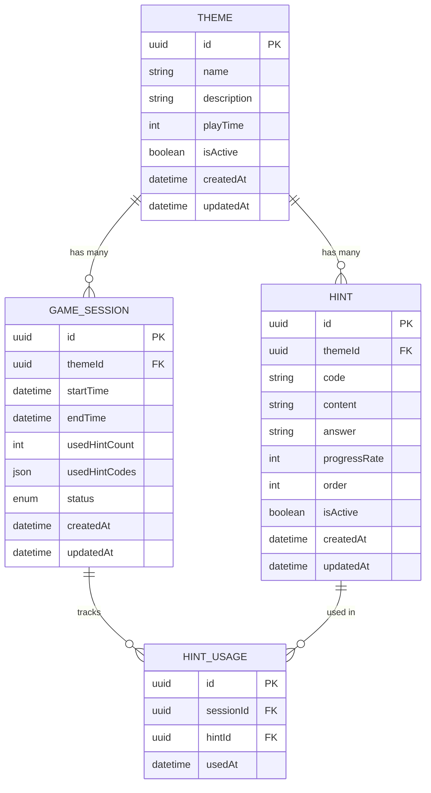

# EscapeHint - 데이터베이스 ERD

## 문서 정보

| 항목            | 내용                                                                                                     |
| --------------- | -------------------------------------------------------------------------------------------------------- |
| **문서 버전**   | 1.2                                                                                                      |
| **작성일**      | 2025-11-26                                                                                               |
| **작성자**      | Architecture Reviewer                                                                                    |
| **승인자**      | 윤인수                                                                                                   |
| **최종 수정일** | 2025-11-28                                                                                               |
| **문서 상태**   | 최종 승인                                                                                                |
| **관련 문서**   | [도메인 정의서](./1-domain-definition.md), [PRD](./3-prd.md), [아키텍처 다이어그램](./6-arch-diagram.md) |
| **데이터베이스** | PostgreSQL (Supabase)                                                                                    |

---

## 개요 (Overview)

본 문서는 EscapeHint 시스템의 데이터베이스 구조를 ERD(Entity Relationship Diagram) 형식으로 표현합니다. Mermaid 형식으로 작성되어 GitHub에서 직접 렌더링 가능합니다.

---

## 엔티티 관계도



---

## 엔티티 설명

### 1. THEME (테마)

방탈출 게임 테마 정보를 관리하는 엔티티입니다.

**주요 필드:**

- `id`: 테마 고유 식별자 (UUID)
- `name`: 테마 이름
- `description`: 테마 설명
- `playTime`: 제한 시간 (분 단위, 10-180분)
- `isActive`: 활성화 상태 (true/false)
- `createdAt`: 생성 일시
- `updatedAt`: 수정 일시

**비즈니스 규칙:**

- 제한 시간은 10분 이상 180분 이하
- 비활성화된 테마는 플레이어 UI에 표시되지 않음
- 테마 삭제 시 관련 힌트도 함께 삭제 (Cascade Delete)

---

### 2. HINT (힌트)

특정 테마에 속한 힌트 정보를 관리하는 엔티티입니다.

**주요 필드:**

- `id`: 힌트 고유 식별자 (UUID)
- `themeId`: 테마 외래키
- `code`: 힌트 코드 (플레이어가 입력하는 코드)
- `content`: 힌트 내용
- `answer`: 정답 (선택 사항)
- `progressRate`: 진행률 (0-100%)
- `order`: 힌트 순서
- `isActive`: 활성화 상태
- `createdAt`: 생성 일시
- `updatedAt`: 수정 일시

**비즈니스 규칙:**

- 테마 내에서 힌트 코드는 고유해야 함 (UNIQUE 제약)
- 진행률은 0-100 범위 제약
- 비활성화된 힌트는 플레이어가 조회할 수 없음
- 힌트 순서는 관리자가 지정 (정렬용)

---

### 3. GAME_SESSION (게임 세션)

플레이어의 게임 진행 상태를 관리하는 엔티티입니다.

**주요 필드:**

- `id`: 세션 고유 식별자 (UUID)
- `themeId`: 테마 외래키
- `startTime`: 게임 시작 시간
- `endTime`: 게임 종료 시간 (완료/중단 시 기록)
- `usedHintCount`: 사용한 힌트 개수
- `usedHintCodes`: 사용한 힌트 코드 목록 (JSON 배열)
- `status`: 세션 상태 (in_progress, completed, aborted)
- `createdAt`: 생성 일시
- `updatedAt`: 수정 일시

**비즈니스 규칙:**

- 세션 상태는 3가지: in_progress(진행 중), completed(완료), aborted(중단)
- `usedHintCodes`는 JSON 배열로 저장 (예: ["H001", "H003"])
- 세션 시작 시 `startTime` 기록
- 게임 완료/중단 시 `endTime` 기록

---

### 4. HINT_USAGE (힌트 사용 기록)

세션별 힌트 사용 이력을 추적하는 엔티티입니다.

**주요 필드:**

- `id`: 기록 고유 식별자 (UUID)
- `sessionId`: 세션 외래키
- `hintId`: 힌트 외래키
- `usedAt`: 힌트 사용 시각

**비즈니스 규칙:**

- 세션과 힌트의 다대다 관계를 연결하는 중간 테이블
- 통계 분석용 데이터 (2차 버전에서 활용)
- 세션 삭제 시 관련 기록도 함께 삭제

---

## 엔티티 관계

### 관계 요약

1. **THEME (1) → (N) HINT**

   - 하나의 테마는 여러 개의 힌트를 가질 수 있음
   - 테마 삭제 시 힌트도 함께 삭제 (Cascade Delete)

2. **THEME (1) → (N) GAME_SESSION**

   - 하나의 테마는 여러 개의 게임 세션을 가질 수 있음
   - 테마 삭제 시 세션은 유지 (통계 보존)

3. **GAME_SESSION (N) ↔ (N) HINT (through HINT_USAGE)**
   - 하나의 세션은 여러 힌트를 사용할 수 있음
   - 하나의 힌트는 여러 세션에서 사용될 수 있음
   - HINT_USAGE 테이블이 중간 테이블 역할

---

## 주요 제약 조건

### 1. UNIQUE 제약

```sql
-- 테마 내 힌트 코드 고유성
UNIQUE INDEX hint_theme_code_unique ON HINT(themeId, code);
```

**설명:** 동일 테마 내에서 힌트 코드는 중복될 수 없습니다.

---

### 2. CHECK 제약

```sql
-- 진행률 범위 제약
CHECK (progressRate >= 0 AND progressRate <= 100);

-- 제한 시간 범위 제약
CHECK (playTime >= 10 AND playTime <= 180);
```

**설명:**

- 진행률은 0-100 범위만 허용
- 제한 시간은 10-180분 범위만 허용

---

### 3. ENUM 제약

```sql
-- 세션 상태 제약
ENUM status ('in_progress', 'completed', 'aborted');
```

**설명:** 세션 상태는 3가지 값만 허용됩니다.

- `in_progress`: 게임 진행 중
- `completed`: 게임 완료
- `aborted`: 게임 중단

---

## Prisma 스키마 예시

```prisma
model Theme {
  id          String        @id @default(uuid())
  name        String        @unique
  description String?
  playTime    Int           @default(60)
  isActive    Boolean       @default(true)
  difficulty  String?
  createdAt   DateTime      @default(now())
  updatedAt   DateTime      @updatedAt
  sessions    GameSession[]
  hints       Hint[]

  @@index([isActive])
}

model Hint {
  id           String      @id @default(uuid())
  themeId      String
  code         String
  content      String
  answer       String?
  progressRate Int         @default(0)
  order        Int         @default(0)
  isActive     Boolean     @default(true)
  createdAt    DateTime    @default(now())
  updatedAt    DateTime    @updatedAt
  theme        Theme       @relation(fields: [themeId], references: [id], onDelete: Cascade)
  usages       HintUsage[]

  @@unique([themeId, code])
  @@index([themeId, code])
}

model GameSession {
  id            String        @id @default(uuid())
  themeId       String
  startTime     DateTime      @default(now())
  endTime       DateTime?
  usedHintCount Int           @default(0)
  createdAt     DateTime      @default(now())
  updatedAt     DateTime      @updatedAt
  status        SessionStatus @default(in_progress)
  theme         Theme         @relation(fields: [themeId], references: [id])
  hintUsages    HintUsage[]

  @@index([themeId, status])
}

model HintUsage {
  id        String      @id @default(uuid())
  sessionId String
  hintId    String
  usedAt    DateTime    @default(now())
  hint      Hint        @relation(fields: [hintId], references: [id], onDelete: Cascade)
  session   GameSession @relation(fields: [sessionId], references: [id], onDelete: Cascade)

  @@unique([sessionId, hintId])
  @@index([sessionId])
}

enum SessionStatus {
  in_progress
  completed
  aborted
}
```

---

## 인덱스 전략

### 1. Primary Key 인덱스

- 모든 테이블의 `id` 필드에 자동 생성
- UUID 타입 사용

### 2. Foreign Key 인덱스

- `HINT.themeId`: 테마별 힌트 조회 성능 향상
- `GAME_SESSION.themeId`: 테마별 세션 조회 성능 향상
- `HINT_USAGE.sessionId`: 세션별 힌트 사용 기록 조회
- `HINT_USAGE.hintId`: 힌트별 사용 통계 조회

### 3. 비즈니스 로직 인덱스

- `THEME.isActive`: 활성 테마 필터링 성능 향상
- `GAME_SESSION.status`: 세션 상태별 조회 성능 향상
- `HINT(themeId, code)`: 힌트 코드 검증 성능 향상 (UNIQUE)

---

## 데이터 무결성 규칙

### 1. 참조 무결성

- 외래키 제약 조건으로 데이터 일관성 보장
- 테마 삭제 시 힌트는 Cascade Delete
- 세션 삭제 시 힌트 사용 기록은 Cascade Delete

### 2. 도메인 무결성

- CHECK 제약으로 유효한 값만 허용
- ENUM 타입으로 상태 값 제한
- NOT NULL 제약으로 필수 값 보장

### 3. 엔티티 무결성

- Primary Key (UUID)로 각 레코드 고유성 보장
- UNIQUE 제약으로 비즈니스 규칙 강제 (테마 내 힌트 코드)

---

## 향후 확장 계획

### 2차 버전 (2026 Q1)

- **HINT_USAGE 활용**: 힌트별 사용 빈도 통계 분석
- **이미지 힌트 지원**: `HINT.imageUrl` 필드 추가
- **플레이어 정보**: `PLAYER` 테이블 추가 (선택 사항)

### 3차 버전 (2026 Q2)

- **동적 힌트 코드**: `HINT.codePattern` 필드로 세션별 고유 코드 생성
- **다국어 지원**: `THEME_I18N`, `HINT_I18N` 테이블 추가

---

## 참고 자료

- [도메인 정의서](./1-domain-definition.md) - 비즈니스 규칙 및 엔티티
- [PRD](./3-prd.md) - 기술 스택 및 요구사항
- [아키텍처 다이어그램](./6-arch-diagram.md) - 시스템 아키텍처 전체 구조
- [Prisma 문서](https://www.prisma.io/docs) - Prisma ORM 가이드

---

## 문서 변경 이력

| 버전 | 날짜       | 작성자                | 변경 내용                                    | 승인자 |
| ---- | ---------- | --------------------- | -------------------------------------------- | ------ |
| 1.0  | 2025-11-26 | Architecture Reviewer | ERD 문서 초안 작성                           | 윤인수 |
| 1.1  | 2025-11-28 | Architecture Reviewer | Prisma 스키마에 맞게 모델 정의 업데이트        | 윤인수 |

---

## 문서 승인

본 문서는 EscapeHint 프로젝트의 공식 데이터베이스 ERD 문서입니다.

**승인자**: 윤인수
**승인일**: 2025-11-26
**문서 상태**: 최종 승인 완료

---

**문서 끝**
